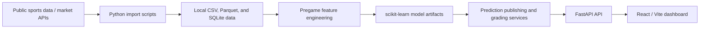

# NFL Quantitative Game Model

[](https://github.com/CadeSchiano/nfl-model/actions/workflows/ci.yml)

A local full-stack sports analytics project centered on NFL pregame game forecasting. The application combines reproducible data-processing scripts, scikit-learn models, a FastAPI/SQLAlchemy API, and a React dashboard to store, inspect, and grade pregame predictions. MLB home-run/game workflows and an FBS-only college-football totals experiment are maintained in separate tables and modules.

This is an experimental analytics project, not a betting product. Model outputs are probabilities and estimates, not guarantees of outcomes or financial returns.

## What is implemented

### NFL game forecasting

- Regular-season home-win probabilities and expected home point differential
- Historical, pregame feature generation from nflverse schedule and play data
- An Elo baseline plus logistic-regression win and linear/Ridge margin models
- A fixed chronological development split: train 2015–2022, validate 2023–24, and final test 2025
- Immutable prediction records, completed-game grading, performance metrics, current Elo ratings, and market-comparison fields
- Optional manual QB-status adjustments that create an explicitly labeled preview without changing an already published prediction

### Additional isolated workflows

- NFL anytime-touchdown ranking with a weekly logistic-regression workflow, active-roster filtering, immutable HIT/MISS grading, and a simple first-touchdown heuristic based on the top anytime-TD candidate
- MLB game-winner/margin and lineup-gated home-run workflows with local, versioned model artifacts and postgame grading
- FBS-vs-FBS college-football total-points projections using rolling same-season scoring features and a Ridge model; FCS matchups are excluded

These workflows are intentionally separated at the database/model level. They should not be interpreted as a single unified model.

## Architecture



Historical/raw data and artifacts are generated locally rather than committed. See [data/README.md](data/README.md) for details.

## How the NFL game model works

For historical NFL games, `backend/app/ml/features.py` reads each team's state before appending that game's result. Feature categories include:

- Pregame Elo and Elo difference
- Prior win percentage, scoring margin, points scored/allowed
- Offensive and defensive yards-per-play, pass/rush efficiency, and turnover differential
- Last-three/last-five scoring margins
- Rest difference and division-game flag

The moneyline target is whether the home team won. The margin target is home score minus away score. Missing numeric values are median-imputed inside the scikit-learn pipelines; numeric features are standardized for logistic/Ridge models. The NFL training script selects between linear and Ridge margin models using only the 2023–24 validation seasons, then evaluates the selected approach on the held-out 2025 season before saving models refit on 2015–24 data.

New NFL predictions blend prior-season strength with only completed current-season games before the target week's first kickoff. Elo is updated through those completed current-season results. The saved game-model artifacts are not retrained weekly; they are refit through the documented offline training workflow.

### Leakage controls inspected

- NFL Elo records a pregame rating/probability before applying each result.
- NFL feature construction snapshots team history before appending the current game's score or play statistics.
- The NFL development/test split is chronological, not random.
- MLB batter/game features and CFB total features are constructed from earlier completed games only; same-time MLB games are batched before their outcomes update team history.
- MLB official HR predictions are only published before first pitch and after both lineups are available; original prediction/model-version fields are retained when results are graded.

These checks reduce obvious temporal leakage paths; they are not a mathematical proof that every possible data-quality issue is absent.

## Evaluation and interpretation

`backend/app/ml/evaluate.py` computes accuracy, Brier score, and log loss for home-win probabilities, plus MAE/RMSE for expected margin. The dashboard also computes metrics from locally graded prediction records. MLB HR performance reports hit rate, Brier score, and log loss for graded official predictions.

No static accuracy, ROI, or profitability claim is published here because live records change with local data and market snapshots. Reproduce the fixed NFL evaluation with:

```bash
python backend/scripts/train_models.py
```

The script prints validation and final-test metrics. A model-market difference is only a disagreement. It is not evidence of a profitable opportunity.

### Reproducible NFL final-test result

The command above was run against the local 2015–2025 nflverse-derived feature
table on September 29, 2026. Its untouched 2025 final-test partition contains
272 games:

| Measure | Result |
| --- | ---: |
| Logistic home-win accuracy | 65.1% |
| Logistic Brier score | 0.222 |
| Logistic log loss | 0.634 |
| Ridge expected-margin MAE | 10.16 points |
| Ridge expected-margin RMSE | 12.86 points |
| Better-record baseline accuracy | 65.4% |
| Sportsbook-favorite baseline accuracy | 65.8% |

The baseline comparison is included for context: the current NFL game model did
not exceed those winner-selection baselines on this one held-out season.
Accuracy is not profitability, and no return-on-investment calculation is
reported.

### Market comparison

The NFL and MLB market services convert two-sided American moneylines to raw implied probabilities, then normalize them to sum to one (a simple no-vig estimate). The application compares that market estimate with the model's home win probability and uses a consistent home-margin sign convention for spread comparison. Market prices are stored as snapshots when available.

## Tech stack

| Area | Verified tools |
| --- | --- |
| Backend | Python, FastAPI, SQLAlchemy, Pydantic |
| Data/ML | pandas, NumPy, scikit-learn, joblib, PyArrow |
| Storage | SQLite for local development |
| Frontend | React, Vite |
| Testing | pytest, FastAPI TestClient |
| CI | GitHub Actions |

PostgreSQL is not configured in this repository today; the local default is SQLite.

## Local development

Requirements: Python 3.12+ and a current Node.js LTS release.

```bash
git clone https://github.com/CadeSchiano/nfl-model.git
cd nfl-model
python -m venv .venv
source .venv/bin/activate
python -m pip install -r backend/requirements.txt
python backend/scripts/initialize_database.py
```

Start the API in one terminal:

```bash
cd nfl-model/backend
source ../.venv/bin/activate
uvicorn app.main:app --reload
```

FastAPI documentation is then available at `http://127.0.0.1:8000/docs`, and `http://127.0.0.1:8000/health` provides a simple liveness check.

Start the frontend in a second terminal:

```bash
cd nfl-model/frontend
npm ci
npm run dev
```

The Vite server prints the local frontend URL (normally `http://localhost:5173`). Set `VITE_API_URL` in ignored `frontend/.env.local` only if the API is hosted somewhere other than the local default.

## Reproducing the NFL historical pipeline

The following commands download public nflverse source data and create ignored local files. They are not necessary for unit tests or CI.

```bash
cd nfl-model
source .venv/bin/activate
python backend/scripts/import_history.py
python backend/scripts/generate_features.py
python backend/scripts/train_models.py
```

`generate_features.py` downloads play-by-play data for 2015–2025, so it can take time and requires network access. Trained artifacts are written locally to `backend/app/ml/models/`.

The repository also includes manual scripts for NFL schedule/odds updates, touchdown workflows, MLB ingestion/training/publishing, and CFB totals. Those operational commands call public or key-protected APIs and are deliberately not run by CI. Review the script docstrings before using an operational workflow.

## Environment variables

Copy the root template if you need live integrations:

```bash
cp .env.example .env
```

| Variable | Purpose | Required for |
| --- | --- | --- |
| `DATABASE_URL` | Optional SQLAlchemy database override | Non-default database location |
| `ODDS_API_KEY` | The Odds API credential | Live NFL, MLB, and CFB market imports |
| `CFBD_API_KEY` | College Football Data API credential | FBS CFB schedule imports |
| `VITE_API_URL` | Frontend API base URL; place in `frontend/.env.local` | Non-default frontend/API pairing |

Never commit `.env` or `frontend/.env.local`. The supplied template contains names only, never credentials.

## Testing and CI

Run backend tests locally:

```bash
cd nfl-model
source .venv/bin/activate
cd backend
python -m pytest tests -q
```

Build the frontend locally:

```bash
cd nfl-model/frontend
npm ci
npm run build
```

The GitHub Actions workflow runs backend dependency installation, Python module compilation, pytest, and a Vite production build on pushes and pull requests. It does not use secrets, a production database, or live sports/odds APIs.

## Project structure

```text
backend/app/api/        FastAPI route modules
backend/app/services/   ingestion, publishing, grading, and market services
backend/app/ml/         feature engineering, model training, and evaluation
backend/app/models/     SQLAlchemy tables
backend/scripts/        manual reproducible and operational commands
backend/tests/          deterministic unit/API tests
frontend/src/           React dashboard and API client
data/                   local-only generated data and SQLite database
```

## Limitations

- The NFL game-model artifacts are not refreshed by a weekly retraining loop, even though newly published features incorporate completed current-season games.
- Injury information is manual QB status input, not a live injury feed.
- NFL first-touchdown picks are a heuristic layered on anytime-TD rankings, not an independently trained first-TD model.
- MLB data availability, lineup confirmation, and market coverage can limit prediction publication.
- CFB totals use simple same-season rolling scoring features and have no historical market-total backtest in the repository.
- Small samples, roster changes, coaching changes, weather, and concept drift all limit forecasting reliability.
- Local SQLite/artifact state is not a deployment or multi-user persistence design.

## Screenshots to add before publication

Capture real local screens and save them under `docs/screenshots/` (then link them here):

1. NFL current-week predictions with probability, margin, and market columns.
2. NFL performance or prediction-history page showing graded records.
3. MLB operations page with an official Top 10 or a clearly empty lineup-gated state.
4. CFB totals page with the FBS conference filter.

Use only screenshots that reflect the actual local data state; avoid showing API keys, browser account details, or unverified performance claims.

## Disclaimer

This project is for software engineering, machine-learning, and sports analytics experimentation. It does not provide financial advice, guarantee outcomes, or establish betting profitability.

## License

No license file is currently included. The repository owner should choose a license intentionally before making the project public.
